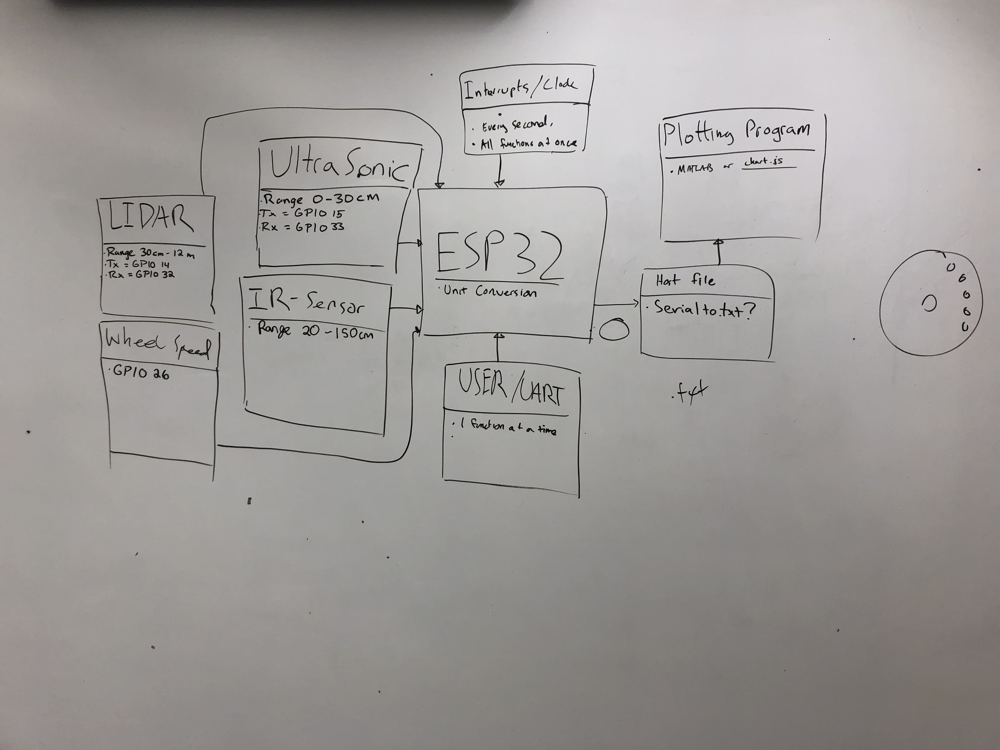

## Swiss Army Sensor
Brian Xu
10/12/18

## Summary
 In this project, I was tasked with combining multiple distance measuring sensors into one chip. I brought up and evaluated a set of different range measurement sensors that will be instrumental in figuring out self-driving and positioning of the car.

## Evaluation Criteria

I decided on the following specifications for a successful solution to this quest:

- Able to read readings from certain sensors while car is in motion:
    - Lidar
    - IR
    - Ultrasonic
    - Wheel Speed
    
- Able to graph the live outputs in engineering units continuously to the screen:
    - Node.js
    - Canvas.js
 

## Solution Design
I used Huzzah32 boards (based on the the ESP32 board) as the main processors in this quest. All three boards were used, one of them was used for 3 of the sensors(Lidar, IR, and Ultrasonic),another one was used to drive the dc motors, and the third board was used for the wheel speed sensor. For the outputs I looked at the datasheets of the individual sensors in order to convert them to engineering units. Using node.js and canvas.js I was able to display the continuous outputs from the sensors to a local server. The driver function worked by calling functions to take a reading and then send it one sensor at a time.The chart only updated after the third sensors data was push onto its data structure.

- Lidar Component: Uses GPIO pins #16 and #17 of ESP32
- Ultrasonic Component: Uses GPIO pins #27 and #33 for triggering and echoing
- Infrared Component: Uses GPIO pin #26 for signal
- Wheel Sensor Component: Uses GPIO pin #25
- Motor uses an H-bridge circuit to enable it to go in both directions. 

## Sketches and Photos

 Flow Chart:

 Board with H-bridge Wiring and Motor:

 Board with Wheel Sensor:

 Board with Lidar, Infrared, Ultrasonic Sensors:

 Graphing Lidar, Infrared, Ultrasonic Sensors:

 Graphing the Wheel Speed Sensors:

## Modules, Tools, Source Used in Solution

- [Node.js](https://nodejs.org/en/)
- [CanvasJS](https://canvasjs.com/)
- [Sparkfun TFMini](https://www.sparkfun.com/products/14588)
- [TFMini Data Sheet](https://cdn.sparkfun.com/assets/5/e/4/7/b/benewake-tfmini-datasheet.pdf)
- [ESP-IDF UART API Reference](https://esp-idf.readthedocs.io/en/latest/api-reference/peripherals/uart.html)
- [Sparkfun Ultrasonic Range Finder](https://www.sparkfun.com/products/13959)
- [Range Finder Data Sheet](https://cdn.sparkfun.com/assets/b/3/0/b/a/DGCH-RED_datasheet.pdf)
- [Sharp IR Rangefinder](https://www.sparkfun.com/datasheets/Sensors/Infrared/gp2y0a02yk_e.pdf)
- [Sparkfun Guide to Optical Encoder](https://learn.sparkfun.com/tutorials/qrd1114-optical-detector-hookup-guide#example-circuit)
- [ESP32 Pulse Couter](https://esp-idf.readthedocs.io/en/latest/api-reference/peripherals/pcnt.html)
- [ESP32 Timer](https://esp-idf.readthedocs.io/en/latest/api-reference/peripherals/timer.html)

## Supporting Artifacts

- [Youtube video demo](https://www.youtube.com/watch?v=GEThrfZNo5A)
